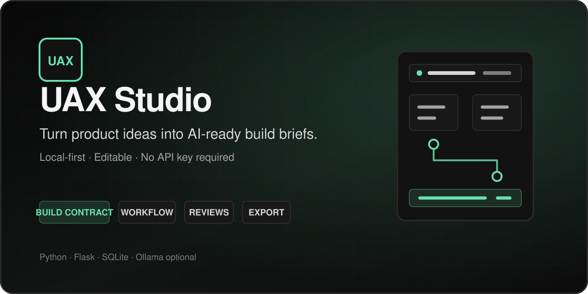

# UAX Studio



UAX Studio is a local-first Flask application that turns product ideas, workflows, and source notes into structured, editable build briefs for apps, agents, websites, automations, and internal tools.

It works without an API key. The default deterministic provider keeps processing on your machine, while optional Ollama support can add suggestions from a locally installed model.

> [!IMPORTANT]
> UAX Studio is designed as a single-user local application. It does not include accounts or access control. Keep the default `127.0.0.1` host unless you intentionally add authentication and production hardening.

## What it does

- Turns one plain-language brief into a product target, feature plan, workflow, and acceptance checks.
- Creates, duplicates, archives, restores, and permanently deletes local projects.
- Accepts pasted text and TXT, Markdown, JSON, CSV, PDF, and DOCX sources.
- Generates deterministic, editable synthesis and contract suggestions without an API key.
- Optionally uses a detected local Ollama model, with deterministic fallback.
- Versions a full Build Contract with implementation details and AI-agent guardrails.
- Models workflow nodes and edges in a vanilla JavaScript canvas with table parity.
- Runs product-quality reviewers and tracks findings.
- Exports Markdown, JSON, Mermaid, hashes, a ZIP bundle, and `AI_BUILD_BRIEF.md`.

## Requirements

- Python 3.10 or newer
- Windows, macOS, or Linux
- Ollama only if you want local-model suggestions; it is not required

## Quick start

### Windows

Double-click `start.bat`, or run:

```powershell
py -m venv .venv
.venv\Scripts\activate
python -m pip install -r requirements.txt
python run.py
```

### macOS or Linux

Run `./start.sh`, or:

```bash
python3 -m venv .venv
source .venv/bin/activate
python -m pip install -r requirements.txt
python run.py
```

Open [http://127.0.0.1:5000](http://127.0.0.1:5000). On first launch, the app creates its local database, a local session secret, and a fictional GalleryFlow demo project.

## Configuration

UAX Studio works with no configuration. For overrides, copy `.env.example` to `.env` and edit only the values you need.

| Variable | Default | Purpose |
| --- | --- | --- |
| `AX_HOST` | `127.0.0.1` | Local server interface. Keep this value for normal use. |
| `AX_PORT` | `5000` | Local server port. |
| `AX_DATABASE_URI` | `sqlite:///ax_studio.sqlite3` | SQLAlchemy database URI. The default database is stored in `instance/`. |
| `AX_DATA_DIR` | `data` | Parent folder for uploaded sources and generated exports. |
| `AX_SECRET_KEY` | generated locally | Optional fixed Flask session secret. Never commit a real value. |
| `AX_ACTIVE_PROVIDER` | `deterministic` | Active suggestion provider. |
| `AX_OLLAMA_BASE_URL` | `http://127.0.0.1:11434` | Local Ollama API base URL. |
| `AX_OLLAMA_MODEL` | `llama3.1` | Preferred local model name. |
| `AX_OLLAMA_TIMEOUT` | `20` | Ollama request timeout in seconds. |
| `AX_AUTO_INIT_DB` | `1` | Runs database setup and migrations during startup. |

## Local data and privacy

Projects, uploaded sources, settings, exports, the SQLite database, and the generated session key remain on the local machine by default. They are intentionally excluded from Git by `.gitignore`.

- Database and settings: `instance/`
- Uploaded sources: `data/uploads/`
- Generated exports: `data/exports/`

Before sharing logs or exported bundles, inspect them for project content and source material.

## Ollama

Ollama is optional. In Settings, select the Ollama provider, enter its local base URL and model, then choose **Test local models**. If Ollama is unavailable or returns invalid structured JSON, UAX Studio shows a fallback notice and uses the deterministic provider.

## Supported uploads

Supported extensions are `.txt`, `.md`, `.json`, `.csv`, `.pdf`, and `.docx`. Individual uploads are limited to 25 MB. Uploaded filenames are never used as storage filenames.

## Export contents

Exports include:

- `README.md`
- `product_intent.md`
- `build_contract.md`
- `agent_experience_contract.md`
- `workflow.md`
- `workflow.mmd`
- `workflow.json`
- `findings.md`
- `acceptance_criteria.md`
- `implementation_manifest.json`
- `AI_BUILD_BRIEF.md`

Sources are excluded unless **Include my source files** is selected. When included, original uploads are stored under `sources/originals/` and editable text copies under `sources/text/`.

## Development

Install development dependencies:

```bash
python -m pip install -r requirements-dev.txt
```

Run the quality checks used by GitHub Actions:

```bash
ruff check .
python -m compileall -q app tests run.py
python -m pytest
```

Tests use temporary SQLite databases and temporary data directories. To reset the fictional demo manually:

```bash
flask --app run.py seed-demo --reset
```

## Project structure

| Path | Purpose |
| --- | --- |
| `app/routes/` | Flask routes and request handling |
| `app/services/` | Core application, provider, export, and security behavior |
| `app/templates/` | Jinja HTML templates |
| `app/static/` | CSS, JavaScript, and icons |
| `app/prompts/` | Editable provider prompt fragments |
| `app/migrations/` | Alembic database migrations |
| `tests/` | Unit and integration tests |
| `data/` | Git-ignored local uploads and exports |
| `instance/` | Git-ignored local database, settings, backups, and secret |

## Current limitations

- No multi-user accounts or remote access controls.
- Browser automation checks are not bundled.
- Ollama quality depends on the locally installed model.
- The workflow canvas is intentionally focused on MVP graph editing.

## License and responsible use

Copyright © 2026 Joseph Fula.

UAX Studio is open-source software available under the [MIT License](LICENSE). It may be used for personal, educational, nonprofit, or commercial purposes subject to the license terms.

The application produces planning and prototyping materials that require human review. Generated content may contain errors or unsuitable recommendations and does not constitute legal, security, compliance, financial, medical, or other professional advice. Users are responsible for protecting confidential information, respecting source-material and model licenses, and validating outputs before implementation. See [DISCLAIMER.md](DISCLAIMER.md) for complete responsible-use information.
